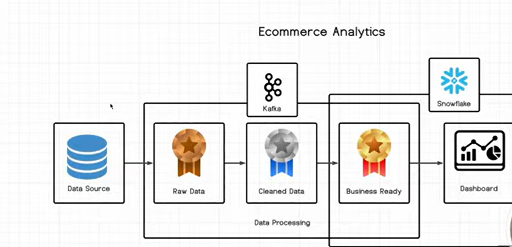

# 🛒 Real-Time E-Commerce Analytics Pipeline

A robust end-to-end data engineering pipeline designed to ingest, process, and visualize real-time e-commerce transaction events using **Apache Kafka**, **Medallion Architecture**, and **Snowflake**.

---

## 🏗️ Architecture Overview

  

The data pipeline follows the **Medallion Architecture** pattern:

* **Data Ingestion (Kafka):** Streams continuous raw e-commerce events from source systems.
* **Bronze Layer (Raw Data):** Ingests and stores raw JSON/unstructured payload events directly from Kafka topics without transformation.
* **Silver Layer (Cleaned Data):** Validates, deduplicates, and cleans data, applying schema enforcement and handling nulls/missing types.
* **Gold Layer (Business Ready):** Aggregates dimensional tables and business metrics (e.g., total sales, top products, user retention).
* **Serving Layer (Snowflake & BI):** Loads gold datasets into Snowflake data warehouse to power real-time dashboards and analytics.

---

## 🛠️ Tech Stack

* **Streaming / Messaging:** Apache Kafka
* **Processing / Architecture:** Medallion Architecture (Bronze -> Silver -> Gold)
* **Data Warehouse:** Snowflake
* **Analytics / BI:** Interactive Dashboards

---

## 🚀 Key Features

* **Low-Latency Streaming:** Real-time event consumption from transactional data sources.
* **Data Reliability:** Schema enforcement and data quality checks within the Silver layer.
* **Optimized Queries:** Pre-aggregated metrics in the Gold layer ready for fast Snowflake reporting.

